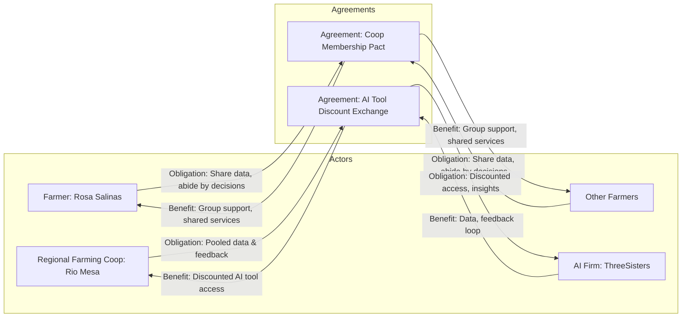

# Game Plan

Working Title:
*Polycentricity* 
By mzargham and... tbd


## Why This Game?

This game is a didactic roleplaying experience designed to explore the dynamics of collaborative governance, strategic negotiation, and creative problem solving. In an increasingly complex world, leaders are frequently required to align diverse interests, balance values and obligations, and form novel structures for cooperation. This game provides a safe but realistic simulation where players can engage with these tensions, practice forming agreements, and reflect on the consequences of different governance choices.

The intention is not to "win" in a traditional sense, but to learn through interaction—by modeling how agreements form, evolve, or break down in multi-stakeholder environments. The structure encourages participants to think across disciplines, synthesize perspectives, and use their unique capacities and resources to build shared value.

## What Is It?

At its core, the game is a structured improvisational roleplay built around a simple graph-based data model. Each player is an **actor**, equipped with a unique role, goals, and assets. Players interact to form **agreements**—these could take many forms: contracts, joint ventures, federations, or novel social or technical constructs. Agreements may be **symmetric** (equal terms for all actors) or **asymmetric** (distinct terms per actor), and can involve any number of actors.

Each agreement involves the exchange of **obligations** (what an actor commits to do or provide) and **benefits** (what they receive in return). These are physically represented on a cork board using tacks, strings, and post-it notes, or digitally via a simple tabular structure that mirrors a bipartite graph.

The design allows complex interdependencies and political-economic dynamics to emerge naturally, while keeping the mechanics simple and intuitive. Players are encouraged to explore unconventional or boundary-pushing governance structures, while staying grounded in the constraints and values of their role.

## Workshop "Paper" Prototype

This section outlines the practical, time-bounded, analog version of the game tailored for the Stanford workshop. It includes the physical setup, game design, and materials needed to support engaging, emergent gameplay.

### Constraints

- **Player Count**: 8 to 12 players
- **Duration**: 110 minutes total (buffered for 120 min session)
  - 20 minutes: Overview of goals and rules  
  - 60 minutes: Free play / negotiation  
  - 30 minutes: Debrief and discussion (did we win?)
- **Materials**:  
  - Role cards (printed and distributed randomly)  
  - Cork board or large whiteboard  
  - Tacks or magnets (1 per actor + 1 per agreement)  
  - String or yarn (to represent edges in the graph)  
  - Sticky notes (for agreement terms and actor-specific notes under strings)  
  - Pens and markers  

### Design

The analog design of the game facilitates creativity while anchoring play in clear visual metaphors for governance and networks. The board visually represents a **bipartite graph**: players (actors) are connected via agreements (nodes), with strings denoting the **directionality** of obligations and benefits.

#### Role Card Template

Each player receives a **Role Card** that defines the constraints and resources they operate under. These include:

- **Backstory**: 2-3 sentences about who they are or who they represent.
- **Values**: Guiding principles or ethical constraints.
- **Goals**: What they seek to achieve during the game.
- **Obligations**: External constraints (e.g., fiduciary duties to non-player actors).
- **Capabilities**: What they can do or offer (transformative capacities; these are "verbs" wheras resouces are "nouns").
- **Intellectual Property**: Privately held specialized knowledge, data, or craft.
- **Rivalrous Resources**: Limited assets such as capital, tools, or physical materials.

#### Bilateral Asymmetric Agreement Template

Used when two players form an agreement with different roles and terms.

**Sticky Note Format:**
- Title of Agreement
- Summary: What it is about (1 sentence)
- Parties: Player A & Player B
- Obligations:
  - From A to B: [list]
  - From B to A: [list]
- Benefits:
  - To A from B: [list]
  - To B from A: [list]

Each string between players and the agreement has a **mini sticky note** underneath showing their personal terms (obligations and benefits).

#### Multilateral Symmetric Agreement Template

Used when 3+ players join an agreement under the same terms.

**Sticky Note Format:**
- Title of Agreement
- Summary
- Parties: A, B, C…
- Shared Obligations: [list]
- Shared Benefits: [list]

Each player has a string from their actor node to the agreement node; mini sticky notes can denote any slight variations if needed, but generally, the agreement is symmetric.

## Examples

This section demonstrates sample role cards and agreement structures in a snapshot of a possible game state, showcasing how obligations, benefits, and collaboration emerge in play.

### Example Role Cards

A guide to authoring role cards is [provided here](https://hackmd.io/RtSo6EZ9QHiI8b6uXni1DA?view), but for the purpose of this document here is an overview. Additional work on role sets corresponding to specific scenarios are here ([Grazing Lands Use Case](https://hackmd.io/4VTGq51CQ5CSvvNph7yjxg?view)) and here ([Grassroots Innovations Assembly for Agroecology Use Case](https://hackmd.io/aRdSyIktSi6QywmmJcyQfA#)).

#### **Actor 1: Farmer – Rosa Salinas**

- **Backstory**: A second-generation farmer managing a 60-acre mixed crop farm. Passionate about regenerative agriculture.
- **Values**: Ecological balance, food sovereignty, peer collaboration.
- **Goals**: Increase yield diversity while reducing input costs.
- **Obligations**: Must remain financially solvent; bound by coop decisions.
- **Capabilities**: Field expertise, crop rotation planning, soil health practices.
- **Intellectual Property**: Longitudinal soil and yield data, traditional knowledge.
- **Rivalrous Resources**: Farm machinery, storage space, limited seasonal labor.

#### **Actor 2: Regional Farming Cooperative – Rio Mesa Cooperative**

- **Backstory**: A member-led organization formed by local farmers to pool resources and make collective decisions.
- **Values**: Solidarity, democratic decision-making, sustainability.
- **Goals**: Negotiate better terms for members, coordinate data sharing.
- **Obligations**: Must act in good faith on behalf of members.
- **Capabilities**: Aggregating data, organizing logistics, interfacing with vendors.
- **Intellectual Property**: Anonymized pooled datasets, coop governance know-how.
- **Rivalrous Resources**: Negotiation leverage, limited IT infrastructure.

#### **Actor 3: AI Firm – ThreeSisters**

- **Backstory**: A small AI startup developing crop compatibility algorithms to support sustainable farming in regional contexts.
- **Values**: Technological empowerment, agroecological alignment, openness.
- **Goals**: Improve model performance, gain real-world feedback, grow market.
- **Obligations**: Investor requirements limit what can be offered pro bono.
- **Capabilities**: Machine learning for ecological optimization, technical support.
- **Intellectual Property**: Proprietary models, climate-adjusted datasets.
- **Rivalrous Resources**: Engineering time, server credits, investor goodwill.

### Example Agreements



#### **Agreement 1: Rio Mesa Cooperative Membership Pact**

- **Type**: Multilateral Symmetric Agreement
- **Summary**: Agreement establishing Rio Mesa Cooperative and the terms of farmer membership.
- **Parties**: Rosa Salinas, 5 other individual farmers
- **Shared Obligations**:
  - All members agree to honor collective decisions made by the coop.
  - Members will contribute monthly updates on farm metrics to the coop’s shared database.
- **Shared Benefits**:
  - Representation in negotiations with vendors and external organizations.
  - Access to shared resources, group purchasing, and strategic planning tools.

**Cork Board Representation**:
- One tack labeled "Rio Mesa Membership Pact"
- Strings connect each farmer's tack to the agreement
- Sticky note under each string:  
  *“Obligations: Share monthly data; abide by coop decisions. Benefits: Group support, shared services.”*

#### **Agreement 2: Data-for-Discount Exchange with ThreeSisters**

- **Type**: Bilateral Asymmetric Agreement
- **Summary**: Coop negotiates a deal with ThreeSisters for discounted access to their crop-planning AI tool in exchange for pooled member data.
- **Parties**: Rio Mesa Cooperative, ThreeSisters
- **Obligations**:
  - From Coop to ThreeSisters:
    - Provide anonymized, structured crop and soil data from member farms.
    - Allow periodic Q&A sessions with farmers for model tuning.
  - From ThreeSisters to Coop:
    - Offer 40% discount on subscription for all member farmers.
    - Provide semiannual reports on ecological optimization insights.
- **Benefits**:
  - To Coop:
    - Affordable tech access, improved planning across members.
  - To ThreeSisters:
    - Real-world data to refine models, credibility in agricultural community.

**Cork Board Representation**:
- One tack labeled "AI Tool Discount Exchange"
- String from Coop tack to agreement with mini note:  
  *“Obligation: Share pooled data. Benefit: Discounted access, optimization reports.”*
- String from agreement to ThreeSisters tack with mini note:  
  *“Obligation: Discount, insights. Benefit: Valuable data, user feedback.”*

### Example Walkthrough

This walkthrough simulates a simplified flow of gameplay for the Stanford workshop version, helping facilitators and players understand how interactions might unfold and how agreements come together.

### Setup Phase (0–20 minutes)

1. **Introduction by Facilitator**
   - Introduce the purpose: exploring creative, collaborative governance.
   - Explain the core structure: actors form agreements which define obligations and benefits.
   - Describe how the **cork board** (or digital sheet) will represent the game graph.

2. **Distribute Role Cards**
   - Each player receives a randomly assigned **role card** detailing their backstory, values, goals, resources, and constraints.
   - Give players a few minutes to read and absorb their role.

3. **Explain Materials**
   - Show how to use **tacks** for actor and agreement nodes.
   - Explain **strings** for relationships (directed edges: obligations & benefits).
   - Post-it notes for agreement terms and actor-specific annotations.

### Free Play Phase (20–80 minutes)

This is the heart of the game — open-ended but guided by player goals.

1. **Initial Conversations**
   - Players begin by networking and discussing their needs and capabilities.
   - Example: A farmer asks others if they’re interested in data-sharing or pooled logistics.

2. **First Agreement Forms**
   - A few farmers decide to form a **cooperative** to coordinate strategy.
   - They agree on shared obligations (data sharing, collective decision-making) and form a **multilateral symmetric agreement**.
   - A new **agreement node** is added to the cork board with a tack.
   - Strings connect each farmer to the agreement, with post-its for shared obligations/benefits.

3. **Cooperative Acts on Behalf of Members**
   - The coop now represents its members in external negotiations.
   - It engages the AI firm (ThreeSisters) to seek technological support.
   - The AI firm is interested, but constrained by its investor obligations.

4. **Negotiation: Bilateral Asymmetric Agreement**
   - The coop offers to share anonymized farm data in exchange for discounted access to the AI tool.
   - An agreement is drafted and posted to the board with distinct obligations/benefits for each side.
   - Strings and annotations are added.

5. **Ongoing Activity**
   - Players continue forming additional side-agreements (e.g., knowledge exchanges, bartering equipment time, etc.).
   - Facilitators can observe which players lead, compromise, hold out, or disrupt.

### Debrief Phase (80–110 minutes)

1. **Freeze Gameplay**
   - No new agreements after this point.

2. **Review the Board**
   - Walk through each agreement:
     - Who is involved?
     - What are the key terms?
     - Are obligations and benefits well balanced?
     - Are there any tensions?

3. **Reflective Discussion**
   - Which agreements came easily? Which were hard?
   - What patterns emerged?
   - How did individual values and obligations influence choices?
   - Were there missed opportunities or unresolved conflicts?
   - What governance models emerged?
   - How might things shift in a second round (with possibility of reneging, penalties, etc.)?

## Moderator Facilitation Tips

Facilitators play a key role in making the experience dynamic, focused, and rich with insight. While the game is player-driven, a light-touch but attentive moderation approach can ensure depth without interrupting flow.

---

### **During Setup (0–20 min)**

- **Set the tone**: Emphasize that the game is not about "winning" but about exploring governance structures through negotiation and creativity.
- **Clarify directionality**: Reinforce the meaning of the arrows — obligations go from actor → agreement, benefits from agreement → actor.
- **Encourage immersion**: Invite players to inhabit their roles fully. Values and obligations on their card should guide their decisions.
- **Mention "quiet powers"**: Some roles may be more subtle or less overtly powerful. Point out that influence isn’t only transactional — credibility, trust, and timing all matter.

### **During Free Play (20–80 min)**

- **Roam and listen**: Walk between groups to observe discussions. Note emerging themes, stuck points, and interesting agreements.
- **Prompt stalled players**: If a player seems unsure, prompt them with gentle questions:
  - “What does your character really need?”
  - “Who here might have a resource or alignment with your goals?”
  - “What’s one small agreement you could start with?”

- **Encourage creative agreements**: Remind players they’re not limited to standard contracts — they can design federations, barters, rotating leadership, etc.
- **Make space for quieter voices**: Gently redirect attention if conversations become dominated.
- **Support documentation**: Ensure agreements get fully documented on the board or digital sheet. Help players write sticky notes if needed.

### **During Agreement Formation**

- **Check for clarity**: Ask: “Does everyone in this agreement understand their obligations and benefits?”
- **Highlight asymmetry**: Encourage explicit discussion when terms are different for each actor — this is where learning often emerges.
- **Ask about enforcement** (lightly): “If someone doesn’t deliver, what happens?” (This plants seeds for future versions with reneging.)

### **During Debrief (80–110 min)**

- **Use the board as anchor**: Physically walk through each agreement or screen-share the diagram.
- **Ask reflective questions**:
  - “What made this agreement possible?”
  - “What tensions did it resolve or create?”
  - “How did values show up in negotiation?”
  - “Which actors had the most leverage — and why?”
  - “What governance model do you think emerged?”
- **Open "what if" scenarios**: “What if you had a second round?” “What if someone broke their agreement?”
- **Invite broader reflection**: “Did anything in this game resemble real-world dynamics in your work?”

Excellent — let’s dive into the **Data Collection** section, which frames the game as a research-friendly experiment in collaborative governance.

## Data Collection

This game offers a powerful opportunity to observe how people construct agreements under real-world-like constraints. By logging actor traits, agreements, and connections, we can analyze patterns in negotiation behavior, governance structures, and network dynamics.

While the game is paper-based, we can track data using a structured **digital mirror** — a spreadsheet or lightweight database with three core entities: **Actors**, **Agreements**, and **Connections**.

### Actors Table

Each player corresponds to a row in this table, capturing static attributes from their role card and metadata like player name or alias.

| Field                 | Description |
|----------------------|-------------|
| `actor_id`           | Unique identifier for the actor |
| `player_name`        | (Optional) Name or pseudonym of the player |
| `role_title`         | Title of the role (e.g., "Farmer: Rosa Salinas") |
| `backstory`          | Short narrative from role card |
| `values`             | List of stated values |
| `goals`              | Player's in-game objectives |
| `obligations`        | External duties or constraints |
| `capabilities`       | Transformative abilities or means |
| `intellectual_property` | Unique data, knowledge, or techniques |
| `rivalrous_resources`   | Tangible assets or limited capital |

> **Where to log this**: `Actors` tab in a Google Sheet or a table in a relational database.

### Agreements Table

Each agreement gets a row, capturing who formed it, when, what kind it is, and the general terms.

| Field              | Description |
|-------------------|-------------|
| `agreement_id`    | Unique identifier |
| `title`           | Name of the agreement |
| `summary`         | 1–2 sentence overview |
| `type`            | Symmetric / Asymmetric |
| `parties`         | List of actor_ids involved |
| `created_at`      | Timestamp of agreement creation |
| `terms`           | Freeform text or structured terms list |
| `notes`           | Additional context, such as reasons or conflicts resolved |

> **Where to log this**: `Agreements` tab or table.

### Connections Table

This table captures **edges in the bipartite graph**: how each actor is connected to each agreement, including their specific obligations and benefits.

| Field              | Description |
|-------------------|-------------|
| `connection_id`   | Unique identifier |
| `actor_id`        | Actor participating |
| `agreement_id`    | Agreement involved |
| `direction`       | `obligation` or `benefit` |
| `description`     | Text summary of what the actor provides or receives |
| `joined_at`       | Timestamp of when the actor signed on (can be after creation) |

For asymmetric agreements, there will be **two entries per actor** (one for obligation, one for benefit). For symmetric ones, a single shared obligation-benefit pair may suffice per actor.

> **Where to log this**: `Connections` tab or a join table in a database.

### Additional Tips for Logging Data

- **Assign a moderator assistant** to capture this in real time (even just snapping photos of the board helps).
- **Use shorthand IDs** for actors and agreements to make linking easier.
- **Optionally timestamp conversations**: When major events occur (first agreement, surprising turn, conflict), note time for later review.
- **Qualitative observations**: Keep a facilitator notepad for emergent themes — e.g., power dynamics, trust breakdowns, or role-play depth.

---

With this structure in place, the data can later be used to:
- Visualize the agreement network over time
- Identify which values or resources correlate with influence
- Explore negotiation styles and group behaviors
- Develop agent-based simulations of future rounds

### Example Data

#### Actors Table (csv)

```csv=
actor_id,player_name,role_title,backstory,values,goals,obligations,capabilities,intellectual_property,rivalrous_resources
A1,Rosa Salinas,Farmer: Rosa Salinas,"Second-generation farmer on a 60-acre mixed crop farm.","Ecological balance, food sovereignty, peer collaboration","Increase yield diversity, reduce input costs","Must remain financially solvent; bound by coop decisions","Crop planning, soil health expertise","Soil and yield data, traditional knowledge","Farm machinery, seasonal labor"
A2,Rio Mesa Coop,Regional Farming Coop: Rio Mesa,"Member-led organization coordinating local farmers","Solidarity, democratic decision-making, sustainability","Negotiate terms, coordinate data sharing","Act in good faith on behalf of members","Aggregating data, organizing logistics","Anonymized datasets, governance structure","Negotiation leverage, IT infrastructure"
A3,ThreeSisters,AI Firm: ThreeSisters,"AI startup focused on crop compatibility algorithms","Agroecological alignment, tech empowerment","Improve models, gain field validation","Investor constraints on free access","ML for ecological optimization","Proprietary models, climate datasets","Engineering time, investor goodwill"
```

#### Agreements Table (csv)

```csv=
agreement_id,title,summary,type,parties,created_at,terms,notes
AG1,Coop Membership Pact,"Agreement establishing the Rio Mesa Coop among farmers",Symmetric,"A1, A2",2025-03-22T10:30:00,"Farmers agree to share data and follow coop decisions","Forms the basis for coop-led negotiation"
AG2,AI Tool Discount Exchange,"Data-for-discount deal between Coop and ThreeSisters",Asymmetric,"A2, A3",2025-03-22T10:50:00,"Coop shares data; ThreeSisters provides discount + insights","Enables tech access to all member farmers"
```

#### Connections Table (csv)

```csv=
connection_id,actor_id,agreement_id,direction,description,joined_at
C1,A1,AG1,obligation,"Share farm data, follow coop decisions",2025-03-22T10:30:00
C2,A1,AG1,benefit,"Access to group support, services",2025-03-22T10:30:00
C3,A2,AG1,benefit,"Authority to negotiate for members",2025-03-22T10:30:00
C4,A2,AG2,obligation,"Provide pooled data and farmer feedback",2025-03-22T10:50:00
C5,A2,AG2,benefit,"Discounted AI tool access for members",2025-03-22T10:50:00
C6,A3,AG2,obligation,"Provide discount and ecological insight reports",2025-03-22T10:50:00
C7,A3,AG2,benefit,"Access to anonymized farm data, real-world feedback",2025-03-22T10:50:00
```

#### Simple HTML mockup

Proof of concept for graph visualization.

- [Code](https://github.com/mzargham/gov-game-demo-viz/blob/main/index.html)
- [Page](https://gov-game-demo-viz.netlify.app/)

## Software Version

The above game is intentionally designed as a low-tech, high-fidelity paper prototype to encourage embodied thinking and physical engagement. However, it also lends itself naturally to a **digitally mediated implementation** that can scale, extend gameplay, and provide rich analytical feedback loops.

This section outlines the **software architecture** and **interface mockups** for a potential digital version.

### Software Architecture Overview

The core digital platform would model the same **bipartite graph** structure (Actors ⇄ Agreements), and include interfaces for players to:
- Enter the game and receive a generated role
- Propose and join agreements
- See real-time visualizations of the agreement network
    - alternatively (see their neighborhood of the graph only for Massively Multiplayer Version)
- Optional: Generate random events and push notifications to players regarding how it affects them (alters actor state)
- Optional: enable and track reneging, and introduce a scoring system (including both individual and group level metrics)

#### Key Components

| Component           | Purpose |
|--------------------|---------|
| **Role Generator** | Instantiates actors with structured values, capabilities, constraints |
| **Agreement Editor** | GUI for proposing bilateral or multilateral agreements |
| **Binding Mechanism** | Allow players to "sign on" to agreements, with timestamps and negotiation history |
| **Graph Visualization** | Dynamic, interactive display of current agreement-actor network |
| **Game Engine / Backend** | Stores and manages all actor, agreement, and connection records |
| **Optional Event Engine** | Introduces external pressures, changes, or uncertainties between rounds |
| **Optional Scoring Engine** | Provides numerical feedback on how well an actor is living up to its their personalized mission, a neighborhood score, and global score|

Here’s the revised **Stack Recommendation** section for the documentation, reflecting your goals of simplicity, compatibility, and a fast development cycle — with clear justifications.

### Stack Recommendation (For Prototype)

This prototype version of the digital game prioritizes **simplicity, low maintenance, and rapid development**. The following stack choices are designed to minimize complexity while providing enough flexibility to support dynamic gameplay and network visualization.

#### Frontend: **Svelte**

- **Why Svelte?**  
  Svelte is a modern JavaScript framework that compiles your code into minimal, fast-loading JavaScript with almost no boilerplate. It’s excellent for building simple, reactive interfaces without the overhead of more complex frameworks like React.

- **What it does:**  
  - Displays player roles and dashboards  
  - Hosts forms for agreement creation  
  - Integrates the graph visualization  
  - Communicates directly with the backend or database (Firebase)

> **Svelte is chosen for its speed, simplicity, and developer-friendly learning curve.**

#### Graph Engine: **D3.js**

- **Why D3.js?**  
  D3 provides fine-grained control over SVG graphics and is ideal for custom interactive visualizations like the actor-agreement graph.

- **What it does:**  
  - Draws and updates the bipartite graph (actors ⇄ agreements)  
  - Allows tooltips, highlighting, or filtering nodes  
  - Responsive to player actions in real-time

> **D3.js is already used in the current prototype and is ideal for bespoke visuals.**

#### Database (No Backend): **Firebase Realtime Database**

- **Why Firebase?**  
  Firebase allows you to store structured data in the cloud and sync it directly to your frontend — no custom backend required.

- **What it does:**  
  - Stores actor, agreement, and connection records  
  - Handles real-time updates (multiple players can see changes live)  
  - Simple rules-based security can be configured for early-stage use

> **Firebase eliminates the need to build a backend at all, accelerating development.**

#### Hosting: **Netlify (Frontend Only)**

- **Why Netlify?**  
  Netlify makes it trivial to deploy Svelte apps from a GitHub repo. With one click, you can have a live URL and automatic updates on every commit.

- **What it does:**  
  - Hosts your Svelte frontend  
  - Automatically rebuilds and deploys from GitHub  
  - No server management needed

> **Netlify keeps deployment easy and free for hobby/experimental use.**

### Architecture Overview

```txt
[ Svelte Frontend ]
       |
       | <—>  Firebase Realtime Database
       |
   [ D3.js Graph ]
```

- **No custom backend required** — Firebase handles storage and sync.
- **Fully browser-based** — accessible to anyone with a link.
- **Scalable in future** — can add authentication, rounds, reneging logic, etc.

### Gameplay Extensions in Digital Space

- **Multi-Round Play**: Add successive rounds of negotiation, possibly with accumulated resources or trust dynamics.
- **Reneging Mechanism**: Allow players to exit agreements at a cost (e.g. reputation, resource penalty).
- **Events Engine**: Inject random or scenario-based events (climate shifts, policy changes, market disruptions).
- **Score Engine**: Evaluate actors performance against their goals at the individual, graph-neighborhood and global graph levels.
- **Metrics and Analytics**: Track number of agreements, symmetry vs asymmetry, actor centrality, agreement centralityy, renege rates and common failure points.
- **Replay & Debrief Tools**: Replay session history, zoom into negotiation chains, and reflect on decision paths.

### Interface Mockups

These mockups define the core interactions players will experience in the digital version of the game. Each interface is minimal by design, but expandable as complexity grows.

### **Player Dashboard**

**Purpose**: The home screen for each player, showing their role, current state, and score metrics.

```txt
+--------------------------------------------------------+
|                     Actor Dashboard                    |
+--------------------------------------------------------+
| 🧑 Name:        Rosa Salinas (A1)                      |
| 🧾 Backstory:   2nd-gen farmer; 60 acres mixed crops   |
|--------------------------------------------------------|
| ✅ Values:     [Ecological Balance] [Collaboration]    |
| 🎯 Goals:      Increase diversity, reduce inputs       |
| ⚖️ Obligations: Bound to Coop decisions               |
| 🛠 Capabilities: Soil health expertise, crop planning |
| 📊 IP:         Yield data, traditional knowledge       |
| 💰 Resources:  Seasonal labor, machinery               |
+--------------------------------------------------------+
| 📈 Score:                                             |
|   Personal Score:        82%                          |
|   Neighborhood Score:    76%                          |
|   Global Score:          69%                          |
+--------------------------------------------------------+
| 📂 Agreements You Belong To:                          |
| - Coop Membership Pact [View]                         |
| - AI Tool Discount Exchange [View]                    |
+--------------------------------------------------------+
| ➕ [ Propose New Agreement ]    🌐 [ View Network ]     |
| 📬 Notifications (2)                                  |
+--------------------------------------------------------+
```

### **Agreement Authoring Modal**

**Purpose**: Where players create and propose agreements.

```txt
+------------------------------------------------+
|              Draft New Agreement               |
+------------------------------------------------+
| 📝 Title: [__________________________]          |
| 🔀 Type:  (•) Bilateral   ( ) Multilateral      |
| 👥 Parties: [ Add Actor ]  A1 ✓  A2 ✓           |
|------------------------------------------------|
| ✍️ Obligations & Benefits:                     |
|   - A1 → AG: "Provide soil data monthly"       |
|   - AG → A1: "Access AI optimization insights" |
|   - A2 → AG: "Provide aggregated coop data"    |
|------------------------------------------------|
| 🧾 Optional Clauses: [Add enforcement or exit] |
| [ Save Draft ]  [ Propose Agreement ]          |
+------------------------------------------------+
```

### **Network Explorer**

**Purpose**: Visualize the live, evolving graph of actors and agreements.

```txt
+------------------------------------------------------+
|             Agreement Network Visualization          |
+------------------------------------------------------+
| 🟢 Actor Nodes     🔵 Agreement Nodes                |
| 🪢 Directed Edges: Obligation → Benefit              |
|                                                      |
|    (A1)──▶[AG1]◀──(A2)──▶[AG2]◀──(A3)                |
|                                                      |
| 🕹️ Mode: (•) Global Graph  ( ) My Neighborhood Only |
| 🛈 Hover for node/edge details                       |
| 🕒 Time slider: [ Mar 22, 10:00 AM ◀▶ 11:00 AM ]     |
+------------------------------------------------------+
```

### **Active Agreement Detail View**

**Purpose**: Inspect a single agreement in depth, including its evolution.

```txt
+----------------------------------------------------+
|        Agreement: AI Tool Discount Exchange        |
+----------------------------------------------------+
| Type: Bilateral | Created: Mar 22, 10:50 AM        |
| Parties: Rio Mesa Coop (A2), ThreeSisters (A3)     |
|----------------------------------------------------|
| 🔄 Terms                                           |
| - A2 → AG: Share pooled data + feedback            |
| - AG → A2: Discounted access to AI tools           |
| - AG → A3: Obligation to deliver insights          |
| - A3 → AG: Access to ground-truth training data    |
|----------------------------------------------------|
| 📈 Scores Impacted:                               |
| - A2 Personal Score: +7% (Fulfilled value: Equity) |
| - A3 Personal Score: +4% (Limited IP release)      |
|----------------------------------------------------|
| ⏱ Joined: [A2: 10:50 AM] [A3: 10:50 AM]            |
+----------------------------------------------------+
| 🔁 [ Propose Amendment ]  ❌ [ Leave Agreement ]     |
+----------------------------------------------------+
```

### **Candidate Agreement View**

**Purpose**: Display the details of a proposed agreement that the actor can choose to enter.

```txt
+--------------------------------------------------------+
|          Candidate Agreement: Crop Data Swap           |
+--------------------------------------------------------+
| Type: Bilateral Proposal | Proposed by: A3 (ThreeSisters) |
| Status: Awaiting Response from You (A1)                |
|--------------------------------------------------------|
| 📝 Summary:                                             |
| A3 offers AI model access in exchange for monthly data |
| from your farm's sensors and rotation logs.            |
|--------------------------------------------------------|
| 📑 Terms:                                               |
| Your Obligations:                                      |
|   - Share anonymized monthly yield + soil data         |
|   - Participate in one quarterly feedback session      |
|                                                        |
| Your Benefits:                                         |
|   - 50% discount on ecological optimization software   |
|   - Access to experimental multi-crop simulation tool  |
|                                                        |
| A3's Obligations:                                      |
|   - Provide AI insights + support reports biannually   |
|                                                        |
| A3's Benefits:                                         |
|   - Ground truth data for training new model versions  |
|--------------------------------------------------------|
| 📈 Score Projection (If You Join):                     |
|   - Personal Score: +6% (data-sharing aligned w/ goals)|
|   - Neighborhood Score: +3%                            |
|   - Global Score: +1%                                  |
+--------------------------------------------------------+
| [✅ Join Agreement]  [🔁 Propose Amendment] [❌ Decline] |
+--------------------------------------------------------+
```

### Notifications Panel

**Purpose**: Show event updates, agreement proposals, reneging alerts.

```txt
+------------------- Notifications -------------------+
| 🟨 Proposal: A3 invites you to join AG3 (Review)     |
| 🔁 Amendment: A2 wants to change AG1 terms           |
| 🌩 Event: Climate anomaly affecting irrigation zones |
| ❗ Breach: A5 has exited AG2 (penalty pending)       |
+------------------------------------------------------+
```

## Chatbot Support

The interactions in this game are semi-structured, and players often need to access complex game state or historical context. The **chatbot interface** serves as a bridge between structured data and natural language, offering accessible, in-context explanations, summaries, and prompts. It helps ensure that the game remains intuitive, transparent, and engaging without requiring players to dig through raw data.

### Potential Functions

| Feature | Description |
|---------|-------------|
| **Context-Aware Queries** | Players can ask: "What agreements am I part of?" or "Who benefits most from Agreement AG2?" |
| **Narrative Summaries** | Translates structured game data (e.g., connections table) into readable summaries: "Rosa Salinas is contributing data in exchange for AI insights." |
| **Agreement Breakdown** | On command, explains the terms of any agreement, including obligations and benefits per actor. |
| **Proposal Assistance** | Guides players through authoring agreements: “Which actors share your goals?” or “Would you like to propose a symmetric or asymmetric agreement?” |
| **Notifications Digest** | Summarizes new events, proposals, or breaches since last check-in: “You have 1 new invitation and 2 amendments pending.” |
| **Score Impact Explanation** | Explains how recent decisions impacted scores: “Joining AG3 improved your neighborhood score by 4%, due to increased alignment with local goals.” |

### Interaction Modes

- **Inline Assistant**: Available as a sidebar or chat bubble on every screen (dashboard, agreement view, network).
- **Data Proxy**: Converts structured records into sentence-form explanations.
- **Copilot for Proposals**: Helps compose agreement terms in semi-natural language and converts them to structured form.
- **Facilitator Companion**: Optional mode for workshop facilitators to generate reflective questions or pull group-level summaries in real time.

#### Example Queries

```txt
👤 Player: “What obligations does A3 have under AG2?”
🤖 Bot: “ThreeSisters (A3) is obligated to provide discounted access to its AI tools and biannual ecological reports under the terms of Agreement AG2.”

👤 Player: “Which actor has the most agreements?”
🤖 Bot: “Rio Mesa Coop (A2) is currently part of 3 active agreements, more than any other actor.”

👤 Player: “How did my personal score change after joining AG4?”
🤖 Bot: “Your personal score increased by 5%, due to fulfillment of your stated value: ‘collaboration with tech partners.’”

👤 Player: “Can you help me draft a proposal to share irrigation tech?”
🤖 Bot: “Sure! Would you like it to be bilateral or multilateral? Who should be included, and what would each party offer?”
```

Here’s a mockup of the **Chatbot Interface** designed to blend seamlessly with your other UI views. It’s simple, text-driven, and context-aware, with features for both querying and proactive assistance.

### Chatbot Interface Mockup

**Purpose**: Allow players to access game state, receive guidance, and draft proposals in natural language — with responses grounded in the game’s structured data.

```txt
+----------------------------------------------------+
|                🧠 Governance Copilot                |
+----------------------------------------------------+
| 👤 You: What agreements is A2 part of?             |
| 🤖 Bot: Rio Mesa Coop is currently in 2 agreements:|
|      - AG1: Coop Membership Pact (Multilateral)    |
|      - AG2: AI Tool Discount Exchange (Bilateral)  |
|----------------------------------------------------|
| 👤 You: Can you help me propose a new deal?        |
| 🤖 Bot: Sure! Let’s start:                         |
|      1. Bilateral or Multilateral?                |
|      2. Who should be involved?                   |
|      3. What are your obligations and benefits?   |
|----------------------------------------------------|
| 👤 You: How did AG2 affect my score?              |
| 🤖 Bot: You gained +4% personal score and +2%     |
|      neighborhood score by aligning with AI value |
+----------------------------------------------------+
| ✍️ Type your question or request...                |
| [_________________________________________] [Send] |
+----------------------------------------------------+
```

### Chatbot Integration

The goal of the chatbot is to facilitate rather than to disrupt or influence human decision-making. Chatbot features prioritize sense-making over decision-making, but can also reduce complexity by providing explanations of complex data, or recommendations for complex inputs.

- **Docked Panel**: Chat sits in a collapsible panel (right or bottom) across all views. Is peripheral to the game rather than replacing the main interface.
- **Contextual Awareness**: Shows agreement/actor names based on screen context. Knows the rules of the game, and the state of the game.
- **Sense-making**: Can offer interpretations of data: “Would you like help interpreting your score changes?”, "Does this candidate agreement conflict with the obligations under my other agreements?"
- **Decision-support**: Can recommend which other actors I might want to talk to, or accept a natural language description of a proposed agreement and create a proposed agreement card to send to another actor.

# Roadmap and Sustainability Plan

## Paper-Prototype
- 1-off Scenario Design
- Facilitated Game Play at Stanford Workshop with Data Capture
- Debrief and Case Study (using Photos, Notes and Spreadsheets)
- Desk Research and User Research

## Proof-of-Concept (PoC)
- Mimick the Paper Prototype in software
- Run some facilitated Sessions
- Gather Feedback and Refine Design

## Minumum-Viable-Product(MVP)
- Stable Release of Open Source Game Software
- Ability to Instatiate Game with User Defined Roles
- Public Documentation so communities can "self-facilitate"
- Gather Feedback Refine Design

## Extended Feature Release (Poc)
- Stable Release with Reneging, Events, and Scores
- Ability to programatically generate Roles
- Run some facilitated Sessions
- Gather Feedback and Refine Design

## Product launch (MVP)
- Stable Hosted Game Service on Cloud Infrastructure
- Supports Public and Private Game Instances
- Public games are free, private hosted games have cost to cover infra
- Paid Scenario Design, Facilitation or Outcomes Analysis Services available from Partners (contributors)
- Aims to be a self-sufficient open source project whose revenues cover labor costs maintainance, operations and services.

## Sustainability Plan
Software to be developed under non-commerical licenses aimed to support community development and researchers at no cost but reserves the right to monetize the game for the team developing and maintaining it. Leveraging the framework described in this game, a multi-lateral contributors agreement will contain obligations for contributors in return for the the benefit commercialization rights. External constraints include, financial sustainability of the project inclusive of covering operating costs, and the on-going maintenance of the software. Commercialization rights may come with revenue sharing requirements, but the specific details of the multilateral contributors agreement will be developed during the Extended Feature Release (PoC) milestone period, and will go into effect during the Product Launch (MVP) milestone period. 

# Glossary

Perfect — here is a comprehensive and well-organized **Glossary** that covers all core concepts introduced in the document. Each definition is concise but clear, with references to how the term is used in gameplay or the data model. This version is suited for inclusion at the end of your document as a definitive reference section.

### **Actor**
> A defined entity within the game’s data model that can make or be subject to agreements.

Actors have structured attributes such as values, goals, obligations, capabilities, intellectual property, and resources. They can represent individuals, organizations, or systems. In the bipartite graph, actors are one type of node.

---

### **Agent**
> An actor who makes decisions or takes actions on behalf of another actor.

Agents appear when one actor delegates authority or responsibility to another. This creates the possibility for **principal-agent dynamics**, where the agent may act contrary to the interests of the principal.

---

### **Agreement**
> A formalized set of terms linking multiple actors through obligations and benefits.

Agreements may be:
- **Bilateral**: between two actors
- **Multilateral**: involving three or more
- **Symmetric**: same terms for all actors
- **Asymmetric**: actor-specific terms

In the graph model, agreements are the second type of node.

---

### **Benefit**
> A positive outcome or value an actor receives under an agreement.

In the graph model, benefits are represented by a **directed edge** from the agreement node to the actor node.

---

### **Bipartite Graph**
> The data structure underlying the game.

The graph has two types of nodes: **actors** and **agreements**. Directed edges indicate:
- **Actor → Agreement**: obligations
- **Agreement → Actor**: benefits

This structure supports both gameplay visualization and data analysis.

---

### **Capability**
> A skill, method, or transformational ability that an actor can apply to create or modify resources.

Unlike resources (which are "nouns"), capabilities are "verbs." They describe what the actor can *do*, not what they *have*.

---

### **Event**
> An external or systemic development that alters the state of one or more actors.

Events can be used in extended gameplay to introduce shocks, uncertainty, or scenario-driven changes. They may modify goals, values, resources, or capabilities.

---

### **Intellectual Property (IP)**
> Privately held knowledge, data, models, or craft an actor controls.

IP is non-rivalrous and often valuable in negotiation. Examples: algorithms, trade secrets, datasets, scientific methods.

---

### **Obligation**
> A commitment or duty an actor assumes as part of an agreement.

Obligations can involve providing resources, performing services, or adhering to collective decisions. Represented in the graph as a **directed edge** from actor to agreement.

---

### **Player**
> A human participant in the real world, engaging in the game.

Players may control one or more actors and are responsible for making decisions on their behalf. Players bring strategic intent, creativity, and interpretation into the simulation.

---

### **Principal**
> An actor who delegates authority to another actor (the agent).

In gameplay, principals are often collectives (e.g., a group of farmers in a coop) who empower a representative or organization to act on their behalf. The potential misalignment between principal and agent creates governance tension.

---

### **Principal-Agent Problem**
> A governance issue where an agent’s actions may not fully align with the interests or obligations of the principal they represent.

This dynamic is modeled in the game when one player represents multiple actors (e.g., both a farmer and the coop), or when collective actors delegate decision-making authority.

---

### **Proposal**
> A candidate agreement drafted by one or more actors and shared with others for consideration.

Proposals include draft terms and become agreements once the required actors join or ratify them. Players can accept, reject, or propose amendments to incoming proposals.

---

### **Resource**
> A tangible or intangible asset controlled by an actor.

Resources are divided into:
- **Rivalrous Resources**: Limited-use assets (e.g., machinery, labor, capital)
- **Non-Rivalrous Resources**: Shareable or replicable assets (e.g., data, models)

Resources are used to fulfill obligations or traded for benefits.

---

### **Rivalrous Resource**
> A resource that cannot be used by multiple actors simultaneously without loss or depletion.

Examples include money, physical tools, and time-limited labor. Rivalrous resources are critical in negotiation and constraint modeling.

---

### **Role Card**
> A structured description of an actor’s profile, distributed to players at game start.

Includes backstory, values, goals, obligations, capabilities, intellectual property, and resources. It guides the player’s decision-making and strategic posture.

---

### **Score**
> A quantitative assessment of how well an actor is fulfilling its mission.

Scores can be calculated at different levels:
- **Personal Score**: Based on alignment with an actor’s own goals and values
- **Neighborhood Score**: Derived from local network interactions using a PageRank-like model
- **Global Score**: A measure of systemic performance, emergent from the entire network

Used in extended gameplay for feedback, ranking, or incentives.

# License 

Zargham et al

[Creative Commons BY-NC-SA](https://creativecommons.org/licenses/by-nc-sa/4.0/legalcode.txt)
- Attribution (BY)
- Non-Commercial (NC)
- Share-Alike (SA)

